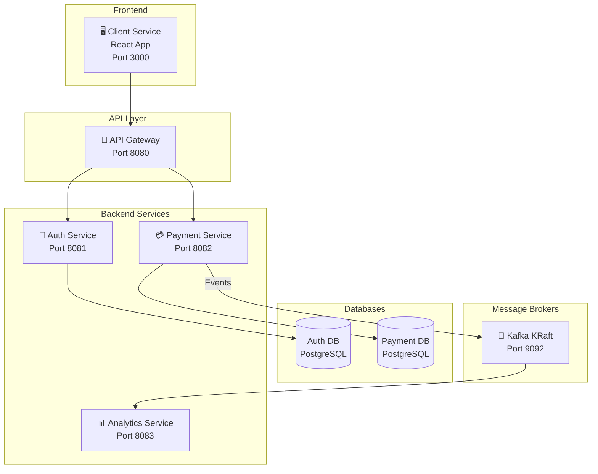
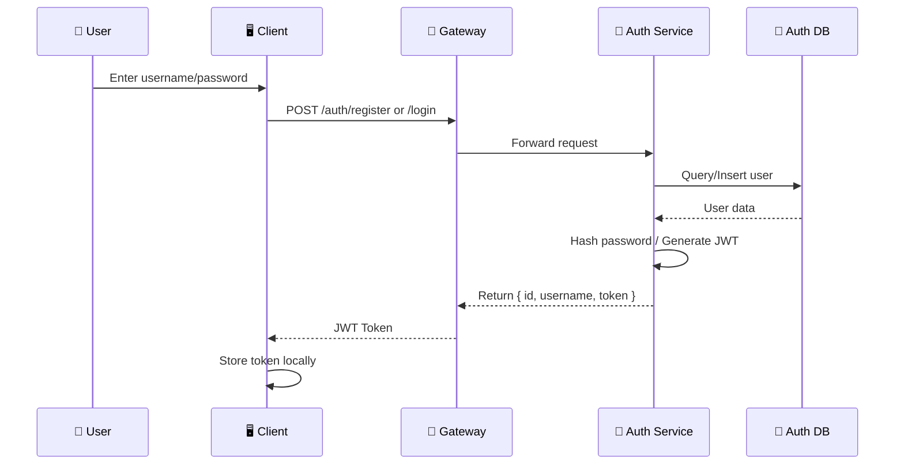
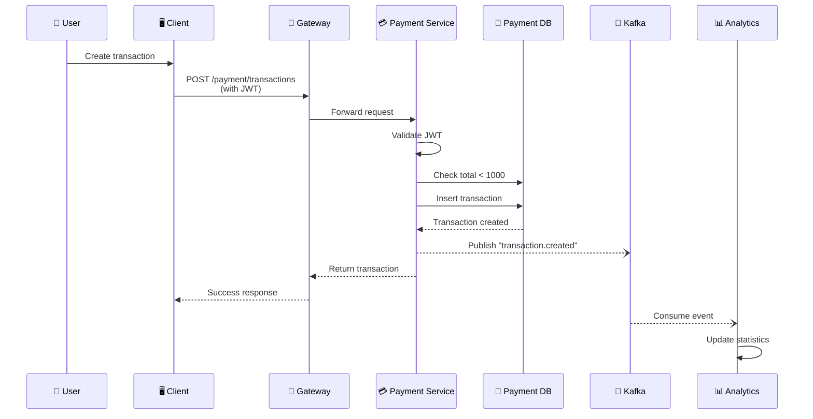
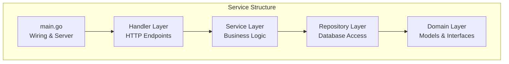
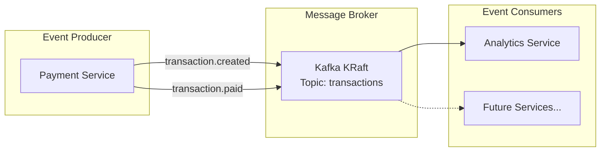

# Go Microservices Architecture

A comprehensive guide to understanding the microservices architecture, workflows, and features.

---

## 🏗️ System Overview



---

## 🔄 User Authentication Flow



---

## 💰 Transaction Flow with Kafka Events



---

## 📦 Service Details

### 🔐 Auth Service

| Endpoint | Method | Description |
|----------|--------|-------------|
| `/register` | POST | Create new user account |
| `/login` | POST | Authenticate and get JWT |

**Features:**
- Password hashing with bcrypt
- JWT token generation (24h expiry)
- User data stored in PostgreSQL

---

### 💳 Payment Service

| Endpoint | Method | Description |
|----------|--------|-------------|
| `/transactions` | POST | Create new transaction |
| `/transactions/list` | GET | Get user's transactions |
| `/transactions/pay` | POST | Mark all as paid |

**Features:**
- JWT authentication required
- Maximum 1000 total per user validation
- **Publishes events to Kafka** on create/pay

---

### 📊 Analytics Service

| Endpoint | Method | Description |
|----------|--------|-------------|
| `/health` | GET | Health check |
| `/stats` | GET | Get aggregated statistics |

**Features:**
- Consumes events from Kafka
- Real-time statistics aggregation
- Tracks transactions by user

**Stats Response:**
```json
{
  "total_transactions": 10,
  "total_amount": 850.50,
  "total_paid_transactions": 5,
  "events_processed": 15,
  "unique_users": 3
}
```

---

## 🏛️ Code Architecture

Each Go service follows a **layered architecture** pattern:



**Directory Structure:**
```
service/
├── internal/
│   ├── domain/       # 📋 Interfaces & models
│   ├── repository/   # 💾 Database operations
│   ├── service/      # ⚙️ Business logic
│   ├── handler/      # 🌐 HTTP handlers
│   └── kafka/        # 📨 Event publishing
├── main.go           # 🚀 Entry point
└── Dockerfile
```

---

## 📨 Event-Driven Architecture



**Event Types:**
| Event | Payload |
|-------|---------|
| `transaction.created` | `{transaction_id, user_id, amount, description, timestamp}` |
| `transaction.paid` | `{user_id, transactions_paid, timestamp}` |

---

## 🚀 Quick Start

```bash
# Start all services
docker compose up -d

# Access points
# Frontend:   http://localhost:3000
# API:        http://localhost:8080
# Analytics:  http://localhost:8083/stats
# RabbitMQ:   http://localhost:15672
```

---

## 🛠️ Tech Stack

| Component | Technology |
|-----------|------------|
| Backend | Go 1.25 |
| Frontend | React + TypeScript |
| Database | PostgreSQL 15 |
| Message Queue | Kafka 3.7 (KRaft) |
| Message Queue | RabbitMQ 3 |
| Gateway | Go HTTP Reverse Proxy |
| Auth | JWT (HS256) |
| Containerization | Docker + Docker Compose |
| CI/CD | GitHub Actions |
